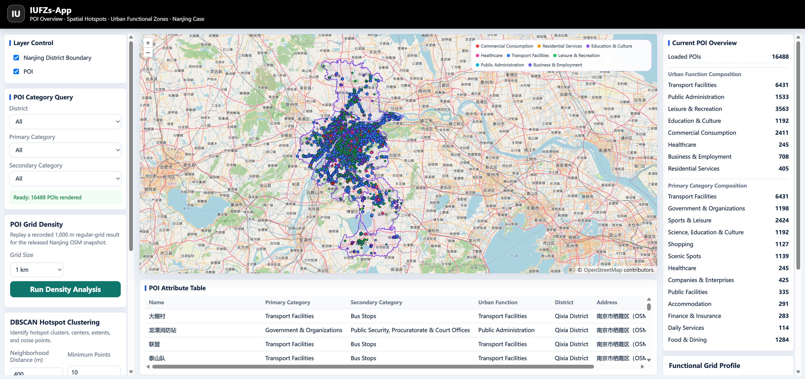
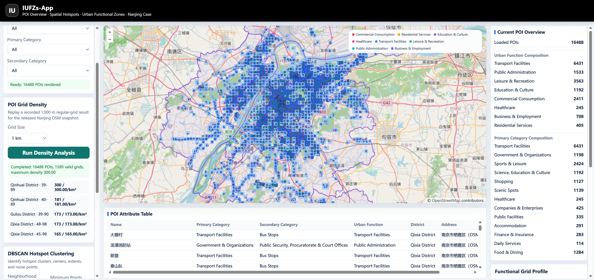
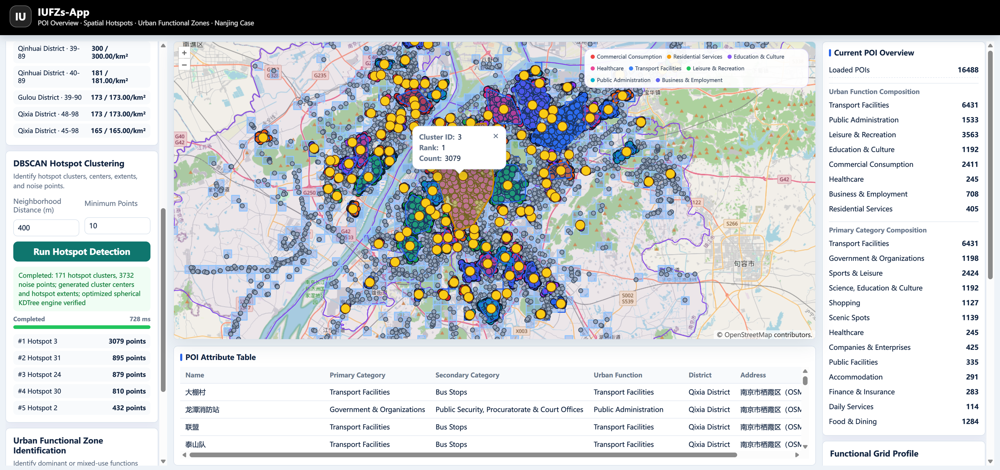
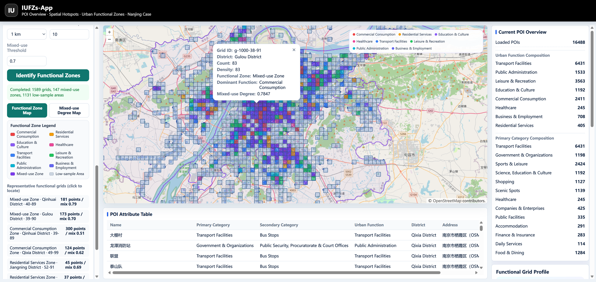

# MapLoom Reproducibility Artifact

This repository accompanies the manuscript **“A Declarative Modeling Method for Geospatial Applications.”** It provides an executable artifact for inspecting the framework and reproducing the application workflow demonstrated by the **IUFZs-App** Nanjing POI case.

The repository includes the AppSpec JSON Schema, a manuscript-reference AppSpec configuration, a separate runnable reproduction AppSpec, executable framework packages, a runnable case application, a public Nanjing boundary, and 16,488 POIs derived from an OpenStreetMap snapshot. The released OSM dataset replaces the restricted dataset used in the manuscript; it supports framework-level software reproduction, but it must not be treated as a reproduction of the manuscript's numerical analytical results or benchmark timings.

## Case demonstration

The IUFZs-App case loads the Nanjing-wide POI dataset and presents three analytical views: grid density analysis, DBSCAN hotspot detection, and urban functional zone identification. The following screenshots show the complete workflow with the released OSM fixture.

### 1. Nanjing-wide POI loading

The application loads and renders 16,488 POIs within the boundaries of Nanjing's 11 districts. The side panels provide category statistics, filtering controls, layer controls, and a queryable POI table.



### 2. Grid density analysis

The grid analysis aggregates POIs into 1 km cells and visualizes their density. In this run, 1,589 valid cells were generated, with a maximum observed density of 300 POIs per square kilometre.



### 3. DBSCAN hotspot detection

DBSCAN groups spatially concentrated POIs into hotspot clusters and distinguishes noise points. With a neighbourhood distance of 400 m and a minimum of 10 points, the released fixture produced 171 clusters and 3,732 noise points.



### 4. Urban functional zone identification

The functional-zone analysis summarizes the POI composition of each grid cell and classifies sufficiently sampled cells by dominant or mixed use. Cells with fewer than the configured minimum number of POIs are reported as **low-sample areas** rather than assigned a potentially unreliable functional label.



## Released contents

- **AppSpec:** the AppSpec v0.1 JSON Schema, an AppSpec configuration corresponding to the manuscript experiments, and a separate runnable AppSpec adapted to the public OSM fixture;
- **Framework:** obfuscated executable packages for the core runtime, plugin registry, event–Action execution, shared State, OpenLayers adapter, WebGIS widgets, and spatial-analysis integration;
- **Case:** the runnable IUFZs-App browser application;
- **Data:** a WGS84 boundary for Nanjing's 11 districts and 16,488 OSM-derived POIs mapped to the case's nine-field POI schema;
- **Reproduction materials:** Overpass queries, raw OSM source snapshots, processing scripts, an OpenAPI contract, recorded analytical responses, and verification utilities;
- **Documentation:** environment, implementation-scope, plugin-contract, provenance, and reproduction notes.

The manuscript-reference AppSpec records the configuration reported in the paper, whereas the runnable reproduction AppSpec is adapted to the independently redistributable OSM-based fixture. Data-dependent parameter differences between the two configurations do not change the AppSpec structure, plugin interfaces, or runtime coordination mechanism exercised by the artifact.

## Quick start

Prerequisites: **Node.js 22.12 or later** and **npm**.

Install the browser-case dependencies and verify the artifact:

```powershell
npm run install:web
npm run verify
```

Start the recorded-response analysis service in one terminal:

```powershell
npm run dev:analysis
```

Start the case application in a second terminal:

```powershell
npm run dev:case
```

Then open <http://127.0.0.1:5176>.

Detailed instructions are available in [`materials/docs/reproduction.md`](materials/docs/reproduction.md). The distinction between implemented, evaluated, and future capabilities is documented in [`materials/docs/implementation-scope.md`](materials/docs/implementation-scope.md).

## Repository structure

```text
framework/                  Obfuscated executable MapLoom packages
cases/
  IUFZs-App/                Runnable Nanjing POI case application
materials/
  appspec/                  AppSpec Schema plus manuscript and reproduction configurations
  service-contract/         External-service and Overpass query contracts
  test-fixture/             Nanjing boundary, OSM POIs, and recorded results
  docs/                     Scope, environment, contracts, and screenshots
  scripts/                  Data preparation, mock-service, and verification tools
```

Key AppSpec files:

- `materials/appspec/appspec-v0.1.schema.json` — AppSpec JSON Schema;
- `materials/appspec/iufzs-manuscript-appspec.json` — configuration corresponding to the manuscript experiments;
- `materials/appspec/iufzs-reproduction-appspec.json` — runnable configuration for the released OSM fixture.

## Verification boundary

The artifact verifies that AppSpec, runtime bindings, plugins, external-service invocation, shared State, dynamic result layers, and widgets execute together using the released packages and recorded responses. Framework source code and the third-party analytical service implementation are not included.

The artifact does not independently establish analytical correctness, cross-engine portability, third-party plugin compatibility, development-effort reduction, or high-concurrency correctness. The mock service replays recorded responses and must not be used for performance benchmarking.

## Data and licensing

The POI fixture is derived from © OpenStreetMap contributors and is distributed under the [Open Data Commons Open Database License](https://www.openstreetmap.org/copyright). Each generated `poi_id` preserves its source OSM object type and identifier.

Acquisition and harmonization are documented in [`materials/test-fixture/osm-processing.md`](materials/test-fixture/osm-processing.md), and boundary provenance is documented in [`materials/test-fixture/boundary-source.md`](materials/test-fixture/boundary-source.md). Project-code licensing does not override third-party data terms.
